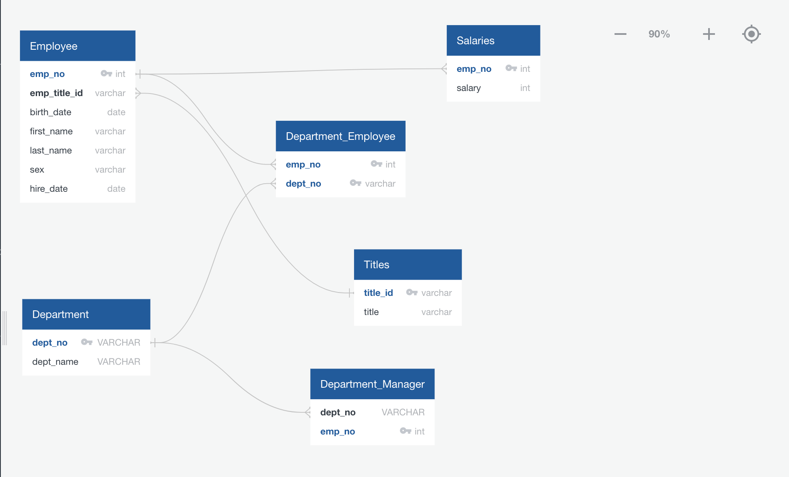

# SQL Project Employee Database

## Overview

This is a research project on employees of the corporation from the 1980s and 1990s. All that remain of the database of employees from that period are six CSV files.

In this work, I designed the tables to hold data in the CSVs, import the CSVs data SQL/data into a SQL database, and answer questions about the data. In other words, I performed:

1. Data Modeling

2. Data Engineering

3. Data Analysis

#### Data Modeling

Inspected the CSVs and sketch out an ERD of the tables and using a tool at [http://www.quickdatabasediagrams.com](http://www.quickdatabasediagrams.com).

#### Data Engineering

* I used the information to created a table schema for each of the six CSV files. Data types, primary keys, foreign keys, and other constraints.

* Then I imported each CSV file into the corresponding SQL table.

#### Data Analysis

I completed the database, then I did the following:

1. List the following details of each employee: employee number, last name, first name, sex, and salary.

2. List first name, last name, and hire date for employees who were hired in 1986.

3. List the manager of each department with the following information: department number, department name, the manager's employee number, last name, first name.

4. List the department of each employee with the following information: employee number, last name, first name, and department name.

5. List first name, last name, and sex for employees whose first name is "Hercules" and last names begin with "B."

6. List all employees in the Sales department, including their employee number, last name, first name, and department name.

7. List all employees in the Sales and Development departments, including their employee number, last name, first name, and department name.

8. In descending order, list the frequency count of employee last names, i.e., how many employees share each last name.
